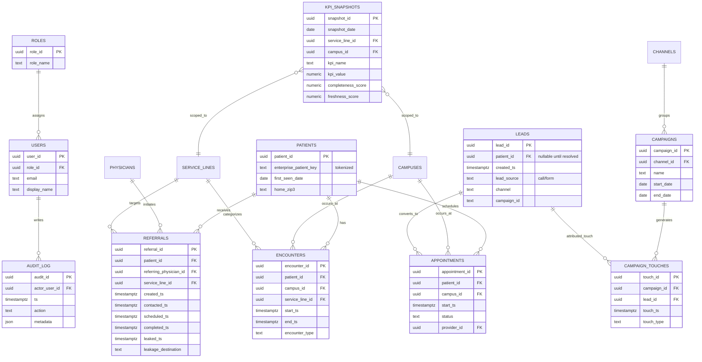

# Northside Hospital Oncology + Cardio‑Oncology Marketing Control Center Dashboard  
*(Requirements extraction, data audit, architecture, visualization plan, implementation options, roadmap, and KPI logic)*

## Executive Summary

This work consolidates and operationalizes the instructions in the “Northside Hospital Dashboard — FINAL MASTER PROMPT (Version 4)” and the attached supporting context into a build-ready dashboard specification focused on **oncology + cardio‑oncology growth**. The core design mandate is to create a **real-time, role-based Sales + Marketing Control Center** that executives and operators can trust—specifically by fixing: multi-touch attribution failure, lack of contribution-margin linkage, missing role-based views, HIPAA pixel restrictions, lack of anomaly explanation, missing cardio‑oncology eligibility→enrollment visibility, and invisible access/scheduling bottlenecks. fileciteturn2file0

Key confirmed system constraints in the primary file include: **Oracle Health (Cerner) Millennium EHR (not Epic)**; **Palantir Foundry already deployed** (build on top, do not recommend replacing); **SAP S/4HANA Cloud** (finance/ERP); **IBM Netezza** (warehouse); **UKG Pro** (HR); **ServiceNow** (ITSM); and Cerner integration paths via **FHIR R4 (Ignite / Oracle Health APIs)** and **HL7 v2 (COI)**. fileciteturn2file0 Official Oracle documentation confirms availability of **FHIR R4 APIs for Oracle Health Millennium Platform**. citeturn4search1turn4search9

Two practical implications shape the dashboard’s structure:
1) “Net-new patient” must be defined with enterprise identity logic and **reported as separate subtypes** (enterprise-new, specialty-new, reactivated >24 months, returning)—not blended—to prevent overclaiming growth. fileciteturn2file1  
2) The dashboard must be **role-based and permission-gated**, with instant role switching and tight control of PHI exposure. fileciteturn2file0

A constraint that blocks a full “existing codebase critique” deliverable: the Version 4 file requires reading a connected GitHub repo first—but **no GitHub connector/repo content is available in the provided sources in this run**, so any critique of the prototype is **unspecified** and cannot be produced without the repo. fileciteturn2file0

## Connected-source inventory and what was found

### Enabled connectors used first

Google Drive connector calls returned **no searchable documents** (including no results for “northside-dashboard-final-V4” and even for broad “northside”), so no Drive-hosted artifacts can be cited from that connector in this run. *(Observed via connector searches; no files returned.)*

Airtable connector is enabled and shows four bases: **KPI Dictionary**, **Role Map**, **Data Source Inventory**, **Agent Specs**. However, each base currently contains a single table with schema fields set up but **records are effectively empty** (placeholders without populated content). *(Observed via Airtable base/table inspection; no substantive KPI/role definitions present.)*

Adobe Acrobat connector is enabled for PDF operations, but no PDFs were located via Drive for extraction during this run.

### Primary files available in attached context

| Item | Where it came from | What it contains (brief) |
|---|---|---|
| **Pasted text.txt** (“Northside Hospital Dashboard — FINAL MASTER PROMPT, Version 4”) | Uploaded context | Master instruction set: confirmed systems, failure modes, required roles, required KPIs, required schema tables, required agents, and required output artefact structure (GAMEPLAN.md sections). fileciteturn2file0 |
| **context.rtf** | Uploaded context | Expanded requirements, essential widgets, role-based philosophy, and practical KPI spine for oncology + cardio‑oncology (funnels, leakage, access, data-trust layer, benchmarks). fileciteturn2file1 |
| **Northside Hospital Cancer + Cardio-Oncology Marketing Control Center.md** | Uploaded context | Prior synthesized research including role-based tiles, agent stack, SLAs, and cost ranges; also contains outbound reference links that should be treated as secondary until independently verified. fileciteturn3file0 |

## Requirements, KPIs, personas, and specified mockups

### Product scope and non-negotiable constraints

The dashboard is explicitly defined as a **Sales + Marketing Control Center** (not a lightweight marketing dashboard) with: executive KPIs, acquisition funnel, referral performance, access/capacity, and a visible data-trust layer. fileciteturn2file1  
The primary clinical/business growth focus for v1 is **oncology + cardio‑oncology**, with operations spanning multiple campuses and distributed cancer/radiation locations. fileciteturn3file10

System and integration “do not contradict” facts (from Version 4) include:
- EHR: **Oracle Health (Cerner) Millennium**. fileciteturn2file0  
- BI/analytics platform already deployed: **Palantir Foundry** (do not replace). fileciteturn2file0  
- Finance: **SAP S/4HANA Cloud**; DW: **IBM Netezza**; HR: **UKG Pro**; ITSM: **ServiceNow**. fileciteturn2file0  
- Preferred integration path from Cerner: **FHIR R4** (Ignite/Oracle Health APIs) and **HL7 v2 via COI**. fileciteturn2file0  
Oracle’s official documentation describes **FHIR R4 APIs for Oracle Health Millennium Platform** and the general EHR API endpoint structure. citeturn4search1turn4search9

### Stakeholders and user personas

The Version 4 file specifies eight roles that must each have a defined view, KPIs (max 7 on primary view), drill-down depth, update cadence, PHI exposure level, mobile requirement, and board-export requirement. fileciteturn2file0

The required roles are:
CMO; VP/Director of Marketing; Oncology Service‑Line Manager; Cardio‑Oncology Program Manager; Physician Liaison; Call Center Manager; Access/Scheduling Manager; CFO Business Partner. fileciteturn2file0

Additionally, the context emphasizes that different stakeholders value different lenses: executives want growth/margin/access/market views; service-line leaders want physician-level leakage and booking speed; marketing leaders want attribution/channel efficiency; physicians/practice managers care about referral quality, schedule fill, and time-to-appointment—therefore one universal view is a failure state. fileciteturn2file1

### Required KPIs and metrics

The Version 4 file mandates a minimum KPI set including (non-exhaustive excerpt):
- **Net‑new patients** as four separate subtypes (enterprise-new, specialty-new, reactivated >24 months, returning). fileciteturn3file3  
- Net‑new oncology patients by tumor site + campus; net‑new cardio‑oncology patients. fileciteturn3file3  
- PAC by channel/service line; LTV:CAC; episode-based campaign ROI over a 12–24 month attribution window; lead→consult conversion; referral lifecycle conversion (created→contacted→scheduled→completed→leaked); referral leakage; time from referral to first oncology consult. fileciteturn3file3  
- Cardio‑oncology pipeline: eligibility screening rate, enrollment conversion, follow-up adherence. fileciteturn3file3  
- Access and call center: next available appointment, call volume, abandonment rate, hold time, appointment conversion. fileciteturn3file3  
- Financial credibility layer: marketing-attributed contribution margin with confidence interval. fileciteturn3file3  
- Market and referral power: geographic market penetration index by ZIP; physician referral relationship score; treatment start and completion rates by tumor site. fileciteturn3file3

The supporting context adds “absolutely essential widgets,” reinforcing funnels, referral lifecycle, access bottlenecks, and geo demand mapping as must-haves. fileciteturn2file1

### Specified UI patterns and mockup expectations

The Version 4 file demands a UI/UX specification: standardized KPI tiles (value, trend, vs target, alert state), chart types per KPI category (funnels, geo map, access, ROI, cardio-oncology pathway), anomaly explanation panel, and a per-tile data trust indicator. fileciteturn3file13  
It also explicitly requires a **board-ready single-page PDF export** and a **mobile Physician Liaison view** (minimum iPhone width 375px). fileciteturn3file13

## Data inventory and audit

### What data assets were actually provided

No structured operational datasets (CSV/Parquet/warehouse extracts) were located in Google Drive via the connector in this run, and the Airtable bases are currently templates without populated KPI/role/data-source definitions.

Therefore, the only “provided data files” available for schema audit in this run are Airtable schemas (mostly empty records) plus unstructured requirement documents (which are requirements sources, not datasets).

### Dataset audit table

| Dataset / Table | Location | Observed schema (fields → type) | Row count | Quality issues found | Remediation steps |
|---|---|---|---:|---|---|
| KPI Dictionary | Airtable base “KPI Dictionary” | Name → text; Notes → multiline text; Assignee → collaborator; Status → select; Attachments → attachments; Attachment Summary → AI text | 3 (empty placeholder rows) | Records contain no KPI definitions; cannot serve as reference data yet | Populate with the required KPI dictionary rows from the Version 4 KPI minimum list; enforce required fields (Name, Formula, Data Source, Cadence, HIPAA risk, Reliability). fileciteturn3file3 |
| Role Map | Airtable base “Role Map” | Same structural fields as above (Name/Notes/Assignee/Status/Attachments/AI summary) | 3 (empty placeholder rows) | No role-to-KPI mapping or PHI exposure classification | Populate per-role tables described in Version 4 Role-Based View Specifications (max 7 KPIs, drill depth, cadence, PHI exposure, mobile, board export). fileciteturn2file0 |
| Data Source Inventory | Airtable base “Data Source Inventory” | Same template fields | 3 (empty placeholder rows) | No enumerated sources/connectors; no schemas; no refresh SLAs; cannot support ingestion planning | Populate with confirmed systems (Cerner, Foundry, SAP, Netezza, UKG, ServiceNow) + any verified marketing/CRM/call tracking sources; add fields for “system of record,” method (FHIR/HL7/API), cadence, PHI classification. fileciteturn2file0 |
| Agent Specs | Airtable base “Agent Specs” | Same template fields | 3 (empty placeholder rows) | No agent definitions / triggers / checkpoints | Populate with the 10 required agents (ingestion, identity, attribution, referral lifecycle, cardio-onc pathway, access/capacity, anomaly, data quality, privacy, executive narrative). fileciteturn3file13 |

### Planned production data sources (cannot be audited yet)

The sources below are explicitly required by the spec but were not provided as extract files in this run, so row counts and quality issues are **unspecified**. The transformation requirements are listed because they are implied by the KPI definitions and the integration constraints.

| Planned dataset | System of record | Acquisition method | Minimum required fields (proposed, derived from KPI needs) | Key transformation needs |
|---|---|---|---|---|
| Patients (master identity) | Cerner Millennium | FHIR R4 | enterprise_patient_id, MRN(s), DOB bucket (or year), sex, home ZIP3/ZIP5 (as allowed), risk cohort flags | Identity resolution across MRN/CRM/call/web IDs; tokenization / minimum necessary per HIPAA approach. HIPAA de-identification methods (Safe Harbor / Expert Determination) should govern what is stored in analytics layers. citeturn0search0turn0search3 |
| Encounters | Cerner Millennium | FHIR R4 | encounter_id, patient_id, service_line, tumor_site (if derivable), campus/location, start/end times, disposition, payer class (if allowed) | Encounter normalization; service line classification; mapping to campaign/referral/lead; time-window logic |
| Appointments / scheduling slots | Cerner Millennium Scheduling | FHIR R4 + HL7 v2 feeds | appointment_id, status, start/end, provider_id, location/campus, specialty/service | Derive next-available appointment; compute scheduling lead time; align with demand funnel |
| Referrals / Service Requests | Cerner Millennium | FHIR R4 (ServiceRequest), possibly HL7 | referral_id, created_at, source provider/practice, specialty/service line, status milestones, destination (internal/external) | Standardize milestone timestamps (created/contacted/scheduled/completed/leaked) for conversion + aging |
| Clinical risk flags (cardio-onc eligibility) | Cerner Millennium | FHIR R4 (Condition / Observation / MedicationRequest etc.) | patient_id, therapy indicators, cardiac risk indicators, eligibility date, screened flag/date | Define eligibility logic; avoid PHI leakage; segregate operational PHI view vs de-identified aggregates |
| Marketing leads (calls/forms) | Marketing stack (unspecified) | API / batch export | lead_id, created_at, channel, campaign, conversion events, source (call/form/referral) | Dedup across sources, stitch to patient identity, define “lead→appointment→consult” funnel |
| Campaign touches | Web analytics + ad platforms | Server-side tagging + APIs | touch_id, timestamp, channel, campaign, creative, landing, consent mode signal | Multi-touch attribution modeling in HIPAA-safe ways (server-side, consent-based) |
| Spend + contribution margin | SAP S/4HANA Cloud | Finance extract | campaign_costs, revenue, cost, margin, payer mix estimates | Align marketing cohorts to financial outcomes; compute confidence intervals and disclose assumptions |
| Geo/demographics reference | Public datasets (Census/ACS) | External | ZIP population, age structure, income, etc. | Normalize to ZIP, compute market penetration index |

## Dashboard information architecture and visualization plan

### Information architecture: pages, widgets, filters, interactions

The architecture below is designed to satisfy the “role-based views” requirement (each with a minimal KPI set) while allowing secure drill-down only where appropriate. fileciteturn2file0

**Global navigation (all roles):**
- Role switcher (single click; permission-gated) fileciteturn2file0
- Global filters (scoped by role permissions): Date range; Service line (default Oncology/Cardio‑Oncology); Campus/location; Channel; Referral source type; Tumor site; ZIP; Provider/Practice (if permitted)
- Data trust panel (freshness/completeness per metric) fileciteturn3file13

**CMO Executive (single-screen + PDF export)**  
Primary purpose: board-ready growth + ROI + access bottlenecks.
- KPI tiles (8 maximum visually; show 5–7 “primary KPIs” and a couple of supporting trust/access tiles)
- Net-new oncology + cardio-oncology (MTD/QTD/YTD vs target)
- Bookings pipeline volume + value estimate
- LTV:CAC gauge with R/Y/G thresholds (benchmarks provided in context) fileciteturn3file18
- Referral leakage + time-to-consult
- Market penetration map by ZIP
- Anomaly explanation panel when metrics swing outside thresholds fileciteturn3file13
- Export: board-ready PDF (single page) fileciteturn3file13

**Marketing Director / VP Marketing (channel + campaign control)**  
Primary purpose: enforce efficiency and real attribution for long-cycle oncology journeys.
- Funnel by channel: impressions → leads → scheduled → completed consult → treatment start (where measurable) fileciteturn2file1
- Patient acquisition cost by channel and service line
- Multi-touch attribution model switcher (first-touch/last-touch/time-decay/position-based) aligned to HIPAA constraints fileciteturn2file1
- “Attribution confidence” and “untracked touchpoint estimate” indicators (explicitly labeled as estimated where needed)

**Oncology Service-Line Manager (operations + leakage)**  
Primary purpose: move patients through consult→treatment; detect drop-offs.
- Oncology funnel waterfall by tumor site
- Leakage by stage and source
- Time from referral to first consult
- Next available appointment by campus/provider
- Treatment start and completion rates by tumor site

**Cardio‑Oncology Program Manager (eligibility → enrollment → adherence)**  
Primary purpose: close eligibility-to-enrollment gap and maintain follow-up.
- Eligibility screened rate fileciteturn3file7
- Enrollment conversion rate fileciteturn3file7
- Follow-up adherence rate fileciteturn3file7
- Referral sources generating cardio-oncology needs
- Correlation panels (screening/enrollment vs outcomes proxies) clearly labeled as associative, not causal

**Access / Scheduling Manager (capacity vs demand)**  
Primary purpose: ensure demand does not die in the appointment queue.
- Next available appointment by specialty/campus/provider fileciteturn3file3
- Scheduling conversion (scheduled vs completed)
- No-show rates and capacity utilization (if available)

**Call Center Manager**
- Call volume, abandonment rate, hold time, appointment conversion fileciteturn3file3
- Breakdown by oncology/cardio-oncology, campus, and daypart

**Physician Liaison (mobile-first)**
- Referral volume by referring physician/practice and trend
- Referral conversion rate + leakage flags
- Territory/ZIP insights and “next actions” list
- Must be mobile responsive and minimal. fileciteturn3file13

**CFO Business Partner**
- Contribution margin (cohort-based) and confidence bounds fileciteturn3file3
- PAC, LTV, LTV:CAC
- Spend vs pipeline health and “measurement reliability” indicators

### Data refresh cadence and SLAs

A tiered SLA pattern is explicitly recommended in the context: scheduling/ADT minute-level; campaign/lead hourly; financial daily; encounter completions T+1 or T+4 hrs with reconciliation. fileciteturn3file6  
FHIR-based clinical extraction is consistent with Oracle’s published Millennium FHIR R4 API availability. citeturn4search1turn4search9

### Visualization recommendations by KPI

The choices below prioritize perceptual accuracy for comparisons and trends (e.g., position/length on common scales), consistent with foundational graphical perception findings by Cleveland & McGill. citeturn0search2

| KPI / metric | Recommended visualization | Why this is the “best fit” |
|---|---|---|
| Net-new patients (by subtype) | Stacked bars by period + small multiples by subtype | Comparisons across time and between categories are most accurate using aligned lengths/positions. citeturn0search2 |
| Net-new oncology by tumor site | Ranked horizontal bars + trend sparklines per tumor site | Ranking supports fast “what grew vs shrank” comprehension; sparklines add direction without clutter. citeturn0search2 |
| Funnel (leads→scheduled→completed→treatment start) | Waterfall or funnel with stage-to-stage conversion labels + drop-off callouts | Shows both volume and conversion; supports stage diagnosis (where patients are lost). fileciteturn2file1 |
| Referral lifecycle conversion | Funnel + aging histogram (days open) | Conversion shows throughput; aging highlights operational delays and leakage risk. fileciteturn3file3 |
| Time from referral to first consult | Line over time (median + P90) + control limits | Median shows central tendency; P90 indicates tail pain; control-limits support anomaly detection. citeturn9search3turn0search2 |
| Cardio-oncology eligibility→enrollment→adherence | Step/funnel + cohort retention curve | Explicitly visualizes the “gap” and follow-up decay patterns. fileciteturn3file7 |
| Next available appointment | Heatmap (campus × specialty) + “worst offenders” list | Heatmap surfaces bottlenecks instantly; ranking list directs action. fileciteturn2file1 |
| Call center abandon rate / hold time | Line chart + threshold bands | Operational metric suited to trend-over-time with alert thresholds. fileciteturn3file3 |
| PAC, LTV:CAC, ROI | Bullet/gauge-style KPI tile + trend line | Executive readability with benchmark bands; keep numeric context. fileciteturn3file18 |
| Geographic market penetration | Choropleth by ZIP + side panel ranking | Geo distribution requires map; always pair with rank table for exact comparisons. fileciteturn2file1 |
| Attribution credit by channel | Multi-model comparison bars (first-touch vs last-touch vs time-decay) | Shows model sensitivity; prevents last-click distortion. fileciteturn3file13 |
| Data trust per KPI | Tiny “freshness/completeness” badge + tooltip with last refresh | Trust layer is mandatory; must be visible but non-intrusive. fileciteturn3file13 |

## Implementation options, BI tools, and cost/effort ranges

### Implementation principle: build on Foundry, don’t replace it

The primary file explicitly states Palantir Foundry is deployed and advises not to recommend replacing it. fileciteturn2file0  
Foundry’s official documentation describes the platform and its governance/security capabilities. citeturn14search0turn14search2

Foundry also supports granular controls: Palantir documents “object and property policies” supporting **cell-level security (row + column)**. citeturn14search3turn14search4 This aligns strongly with HIPAA role-based minimum-necessary access patterns.

### BI / visualization tool comparison

At least four tools are compared below (plus Foundry, given it’s a required constraint).

| Tool | Strengths for this use case | Weaknesses / cautions | Pricing signals (official where available) |
|---|---|---|---|
| **Palantir Foundry (existing)** | Strong data integration + governance; object/property security; can serve as “source of truth” platform layer. citeturn14search0turn14search3 | Licensing/pricing not publicly standardized; requires Foundry-skilled developers; UI may need custom “executive polish” layer | Pricing not cited (customer-specific) |
| **Tableau** | Powerful visualization, executive-quality dashboards; broad adoption | RBAC often depends on data platform setup; licensing can scale quickly | Tableau Server per-user annual-billed list pricing shows Viewer/Explorer/Creator tiers. citeturn2search2turn2search7 |
| **Power BI (Fabric)** | Cost-effective per-user; strong Microsoft ecosystem integration | Healthcare governance depends on tenant controls; some advanced features require PPU/capacity | Microsoft lists Pro ($14 user/month yearly) and PPU ($24 user/month yearly). citeturn1search1turn1search3 |
| **Looker (Google Cloud core)** | Semantic modeling layer (LookML), governed metrics; strong for consistency | Pricing is “call sales”; requires LookML skill; modeling upfront cost | Google explains platform + user pricing components and user types. citeturn1search0 |
| **Apache Superset** | Open-source; flexible; supports security roles and row-level security constructs | Requires self-hosting and hardening; more engineering overhead | Superset docs describe security configurations and row-level security APIs. citeturn2search1turn2search0turn2search4 |

### Hosting / infrastructure options aligned to the spec

The Version 4 file’s target build stack mentions **Next.js + Vercel + Supabase**, plus **DuckDB/MotherDuck** for de-identified aggregates. fileciteturn2file0

Given HIPAA constraints, a practical architecture is:

**Option A (Recommended): Foundry-first data + secure web app for role UX**
- Foundry: ingestion, transformation, governed datasets/ontology, PHI controls (as needed)
- Web app: Next.js front-end for role-based UX polish, but only consumes **de-identified aggregates** (or PHI only for explicitly authorized operational roles, if hospital policy allows)
- Supabase: application auth + RLS for app tables (roles, audit, cached KPI snapshots). Supabase RLS is a Postgres feature and is intended for granular authorization “defense in depth.” citeturn3search1
- Vercel: front-end hosting (keep ePHI out of Vercel unless a BAA/controls exist—**unspecified** in sources)
- MotherDuck: optional analytics store for de-identified metrics; MotherDuck lists an Enterprise plan that includes HIPAA BAA capability. citeturn6search2

**Option B: BI-tool-first (Power BI / Tableau / Looker)**
- Requires duplicating some of Foundry’s governance investment unless tightly integrated
- Can be fast for visualization but often weaker for “single source of truth” and complex healthcare identity stitching without a strong data platform underneath

### Effort and cost ranges

Because no repo and no real data extracts were provided, estimates below are necessarily coarse and should be treated as **planning bands** not quotes.

A pragmatic starting range (v1 oncology + cardio-oncology, role-based, with at least one Cerner data feed + identity stitching + basic attribution + trust layer):
- **MVP (CMO view + oncology funnel + access basics):** ~6–10 weeks, 2–4 FTE-equivalents  
- **Role-complete v1 (all role views + foundational agents):** ~10–16 weeks, 4–7 FTE-equivalents  
- **Full “attribution + margin + anomaly explanation + board exports”:** ~16–24+ weeks, 6–10 FTE-equivalents

The CMO credibility risk (“prove marketing value”) is supported by Gartner’s reporting that only **52% of senior marketing leaders** can prove marketing’s value and receive credit for outcomes, reinforcing the need to prioritize margin linkage and trust layers. citeturn13search0

## Roadmap, resourcing, and risk mitigation

### Prioritized roadmap aligned to the Version 4 phase structure

The Version 4 file provides a phased timeline (foundation → CMO MVP → all roles + real data → attribution + agents + board export). fileciteturn1file8 The roadmap below keeps that structure but adds explicit deliverables and risk gates.

```mermaid
gantt
    title Northside Control Center Roadmap (Oncology + Cardio-Oncology v1)
    dateFormat  YYYY-MM-DD
    excludes    weekends

    section Foundation (Plan + Security + Data Inventory)
    Stakeholder KPI freeze + role matrix           :a1, 2026-04-06, 10d
    Data source inventory + access approvals       :a2, 2026-04-06, 15d
    Supabase auth/RLS skeleton + audit logging     :a3, 2026-04-13, 14d
    Foundry dataset/ontology mapping draft         :a4, 2026-04-13, 14d

    section CMO MVP
    KPI tiles + trust badges + export layout       :b1, 2026-04-27, 14d
    Net-new patient logic v1 + funnel v1           :b2, 2026-04-27, 14d
    Access bottleneck + referral leakage MVP       :b3, 2026-05-04, 10d

    section Role Expansion + Real Data
    Oncology Ops + Cardio-Onc pages                :c1, 2026-05-18, 20d
    Call center + Access/Scheduling views          :c2, 2026-05-18, 20d
    Physician Liaison mobile view                  :c3, 2026-05-25, 15d

    section Attribution + Margin + Agents
    Identity resolution + attribution v1           :d1, 2026-06-15, 25d
    Contribution margin linkage (SAP)              :d2, 2026-06-22, 20d
    Anomaly detection + explanation panel          :d3, 2026-07-06, 20d
```

### Resource roles needed

A minimum viable team composition (roles, not headcount commitments):
- Product owner (marketing/strategy)
- Clinical operations SME (oncology + cardio-oncology workflow)
- Data engineer (Foundry / ingestion)
- Analytics engineer (metric definitions, transformations, testing)
- Full-stack engineer (Next.js + auth + role UX)
- Security/privacy officer (HIPAA controls, access review, audit policy)
- QA/monitoring engineer (data validation + alerting)

### Risk register and mitigations

| Risk | Why it matters | Mitigation |
|---|---|---|
| Identity resolution failure | Breaks net-new definitions and attribution; creates executive distrust | Implement confidence-scored matching; keep “unknown/unmatched” visible; human review queue; audit log. fileciteturn3file13 |
| Scheduling data latency | Access bottlenecks become invisible; marketing demand “expires” in queue | Use near-real-time HL7/ADT + scheduling feeds where available; SLA tiering as specified. fileciteturn3file6 |
| Contribution margin linkage delays | CFO/board won’t trust ROI; funding risk | Deliver interim “pipeline value estimate” labeled as estimated; prioritize SAP integration as Phase 4. fileciteturn3file3 |
| HIPAA tracking constraints | Web attribution gaps (no pixel PHI) | Use server-side, consent-driven first-party events; show attribution confidence interval; follow HIPAA de-identification guidance. citeturn0search0turn0search3 |
| Tool sprawl / platform duplication | Costs and governance complexity | Anchor on Foundry for data + governance (existing), minimize extra BI licensing. fileciteturn2file0 |
| “Alert fatigue” | No adoption if anomalies lack context | Require anomaly explanation panel; tie to known operational causes (e.g., downtime, campaign pauses). fileciteturn3file13 |

## Wireframes, ER data model, KPI transformations, and validation plan

### Sample wireframes

These mockups implement the required patterns: role switch, KPI tiles, funnel + leakage, and mobile liaison view. fileciteturn3file13


### Data model ER diagram

The Version 4 file specifies minimum required tables (patients, encounters, appointments, referrals, leads, campaigns, campaign_touches, channels, physicians, service_lines, campuses, kpi_snapshots, users, roles, audit_log). fileciteturn3file13



### KPI computation logic and required transformations

Below are **implementation-grade formulas/pseudocode** aligned to the required KPI list. Any element not explicitly defined in sources is marked as a **required design decision** rather than assumed.

**Net-new patient classification (required for multiple KPIs)**  
Requirement: split into enterprise-new, specialty-new, reactivated (>24 months), returning. fileciteturn3file3  
Key decision needed (unspecified in sources): the identity “enterprise_patient_key” method and “specialty attribution” rules.

Pseudocode:
```sql
-- Inputs:
-- encounters(patient_id, service_line_id, start_ts)
-- params: lookback_months = 24

with patient_history as (
  select
    patient_id,
    min(start_ts) as first_encounter_ts,
    max(start_ts) as last_encounter_ts
  from encounters
  group by patient_id
),
service_history as (
  select
    patient_id,
    service_line_id,
    min(start_ts) as first_service_ts,
    max(start_ts) as last_service_ts
  from encounters
  group by patient_id, service_line_id
),
as_of as (
  select current_date as as_of_date
),
classify as (
  select
    s.patient_id,
    s.service_line_id,
    case
      when s.first_service_ts = p.first_encounter_ts then 'enterprise_new'
      when p.last_encounter_ts < (as_of.as_of_date - interval '24 months') then 'reactivated_24mo'
      when s.first_service_ts is not null and s.first_service_ts > p.first_encounter_ts then 'specialty_new'
      else 'returning'
    end as new_patient_type
  from service_history s
  join patient_history p using (patient_id)
  cross join as_of
)
select * from classify;
```

**Core KPI formulas** (illustrative; uses recommended tables above):

- **Net-new oncology patients (by tumor site, campus)**  
  - Numerator: count(distinct patient_id) where service_line=Oncology and new_patient_type in (enterprise_new, specialty_new, reactivated_24mo) and encounter in period  
  - Segmentation: tumor_site, campus fileciteturn3file3

- **Net-new cardio-oncology patients**  
  - Requires cardio-oncology service-line definition (unspecified) plus “enrolled” definition (specified as KPI but not operationally defined). fileciteturn3file7

- **Lead→consult conversion rate by channel**  
```sql
select
  channel,
  count(distinct case when consult_completed_ts is not null then lead_id end)
  / nullif(count(distinct lead_id), 0) as lead_to_consult_rate
from lead_funnel
where service_line='Oncology'
  and lead_created_ts between :start and :end
group by channel;
```

- **Referral conversion: created→contacted→scheduled→completed→leaked** fileciteturn3file3  
```sql
select
  service_line_id,
  count(*) as referrals_created,
  count(*) filter (where contacted_ts is not null) as contacted,
  count(*) filter (where scheduled_ts is not null) as scheduled,
  count(*) filter (where completed_ts is not null) as completed,
  count(*) filter (where leaked_ts is not null) as leaked,
  (count(*) filter (where completed_ts is not null))::numeric / nullif(count(*),0) as created_to_completed_rate,
  (count(*) filter (where leaked_ts is not null))::numeric / nullif(count(*),0) as leakage_rate
from referrals
where created_ts between :start and :end
group by service_line_id;
```

- **Time from referral to first oncology consult (days)** fileciteturn3file3  
```sql
select
  percentile_cont(0.5) within group (order by (consult_completed_ts - referral_created_ts)) as median_time,
  percentile_cont(0.9) within group (order by (consult_completed_ts - referral_created_ts)) as p90_time
from oncology_referral_to_consult
where referral_created_ts between :start and :end;
```

- **Next available appointment by specialty/campus/provider** fileciteturn3file3  
```sql
select
  campus_id,
  provider_id,
  specialty,
  min(start_ts) as next_available_start_ts
from appointment_slots
where status = 'free'
  and start_ts >= now()
group by campus_id, provider_id, specialty;
```

- **Cardio-oncology eligibility screening rate** fileciteturn3file7  
Key decision: “eligible” logic (e.g., therapy/risk factors). Must be explicitly defined and validated clinically.
```sql
select
  count(*) filter (where screened_ts is not null)::numeric / nullif(count(*),0) as screening_rate
from cardio_onc_eligible_patients
where eligible_ts between :start and :end;
```

- **Cardio-oncology enrollment conversion (enrolled / screened)** fileciteturn3file7  
```sql
select
  count(*) filter (where enrolled_ts is not null)::numeric
  / nullif(count(*) filter (where screened_ts is not null),0) as enrollment_rate
from cardio_onc_eligible_patients
where eligible_ts between :start and :end;
```

- **Follow-up adherence** fileciteturn3file7  
Key decision: adherence window rules (e.g., follow-up within 30/60/90 days).
```sql
select
  count(*) filter (where followup_completed_within_window = true)::numeric / nullif(count(*),0) as adherence_rate
from cardio_onc_enrolled_cohort;
```

- **Patient Acquisition Cost (PAC)** fileciteturn3file3  
```sql
select
  channel,
  sum(spend_amount) / nullif(count(distinct net_new_patient_id),0) as pac
from spend_by_channel s
join net_new_patients n
  on n.attributed_channel = s.channel
where s.spend_date between :start and :end
  and n.first_oncology_encounter_date between :start and :end
group by channel;
```

- **LTV:CAC** fileciteturn3file3  
Key decision: LTV method (e.g., contribution margin over 12/24/36 months). This is explicitly required but not fully specified. fileciteturn3file3
```sql
select
  cohort,
  (sum(contribution_margin_24mo) / nullif(sum(acquisition_cost),0)) as ltv_to_cac
from cohort_economics
group by cohort;
```

- **Episode-based campaign ROI (12–24 months)** fileciteturn3file3  
```sql
select
  campaign_id,
  sum(contribution_margin_24mo) / nullif(sum(spend_amount),0) as roi_24mo
from campaign_cohort_margin
where cohort_start between :start and :end
group by campaign_id;
```

- **Marketing-attributed contribution margin with confidence interval** fileciteturn3file3  
Key decision: method for uncertainty (e.g., bootstrap over attribution weights, or model-based). Must be explicit and auditable.

- **Geographic market penetration index by ZIP** fileciteturn3file3  
Requires external population baseline (unspecified).  
```sql
select
  zip,
  (new_oncology_patients / nullif(zip_population,0)) as penetration_rate,
  (new_oncology_patients / nullif(zip_population,0)) / nullif((total_new_oncology / total_population),0) as penetration_index
from zip_oncology_counts;
```

- **Physician referral relationship score (composite)** fileciteturn3file3  
Must be defined as a transparent composite (volume, conversion, recency, engagement). No definition exists in provided sources, so this is a required design decision.

### Testing, monitoring, and SLAs

**HIPAA/privacy controls**  
- Use HIPAA de-identification approaches (Safe Harbor or Expert Determination) and document the chosen method and risk basis. citeturn0search0turn0search3  
- Enforce “minimum necessary” access via role-based policy controls (Foundry supports cell-level security; Supabase supports Postgres RLS). citeturn14search3turn3search1

**Data validation checks (automated):**
- Schema checks: column existence/types, required fields present
- Completeness: not-null for keys and critical timestamp milestones
- Uniqueness: unique keys at each table grain
- Referential integrity: lead→appointment, referral→encounter, patient→encounter links
- Freshness checks: last-ingested timestamps within SLA per domain

Great Expectations is explicitly designed for expectation-based validation and can generate Data Docs for ongoing reporting. citeturn9search5turn9search6  
dbt-style testing practices emphasize basic checks such as uniqueness and non-nullness for primary keys, supporting regression prevention. citeturn12search8turn12search7

**Operational monitoring and alerting:**
- Pipeline SLAs by data type (minute-level scheduling/ADT; hourly leads; daily finance) as recommended in the context. fileciteturn3file6
- Metric-level anomaly detection using statistical process control (control limits) as a foundation for “when should we alert.” citeturn9search3
- Alert routing: role-based (call center alerts to call center manager; access alerts to scheduling; financial credibility alerts to CFO partner)

**Observability + audit:**
- Immutable audit log for data transformations and agent actions (explicitly required in the schema list). fileciteturn3file13
- “Data trust” badges on every KPI tile (freshness + completeness scores) are explicitly required. fileciteturn3file13

**SLA proposal (aligned to the provided guidance):**
- Scheduling + ADT availability metrics: ≤15 minutes latency target
- Lead/call events: ≤1 hour latency target
- Encounter completion/treatment events: T+1 day with reconciliation option (or T+4 hours where feasible)
- Finance/margin: daily refresh with month-end close reconciliation

These tiers match the source’s explicit tiering guidance. fileciteturn3file6